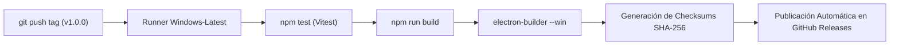

<div align="center">
  
  <h1>ReInstall Hub</h1>
  <p><strong>La Suite Definitiva Post-Formateo para Windows impulsada por WinGet</strong></p>
  <p>Instala en lote todas tus aplicaciones esenciales tras formatear un equipo con un solo clic. Portabilidad total en USB, perfiles inteligentes y cero residuos.</p>

  <p>
    <a href="#-descarga-rápida"></a>
    
    
  </p>
</div>

---

## 📋 Tabla de Contenidos

- [⚡ Descarga Rápida](#-descarga-rápida)
- [✨ ¿Por qué ReInstall Hub?](#-por-qué-reinstall-hub)
- [🚀 Modo Portable en USB (Cero Residuos)](#-modo-portable-en-usb-cero-residuos)
- [🛡️ Características Principales](#️-características-principales)
- [📂 Perfiles de Fábrica Incluidos](#-perfiles-de-fábrica-incluidos)
- [📦 Catálogo Verificado (118+ Aplicaciones)](#-catálogo-verificado-118-aplicaciones)
- [💻 Guía para Desarrolladores](#-guía-para-desarrolladores)
  - [Requisitos Previos](#requisitos-previos)
  - [Instalación y Ejecución](#instalación-y-ejecución)
  - [Compilación del Ejecutable](#compilación-del-ejecutable)
- [⚙️ CI/CD Automatizado con GitHub Actions](#️-cicd-automatizado-con-github-actions)
- [📄 Licencia](#-licencia)

---

## ⚡ Descarga Rápida (100% Portable para USB)

No necesitas instalar absolutamente nada en tu computadora ni en la de tus clientes:

1. Ve a la sección de **[Releases](../../releases)** del repositorio.
2. Descarga la versión que prefieras:
   - **📁 `ReInstall-Hub-Portable-Folder-1.0.0.zip` (Recomendado)**: La carpeta portable completa del programa comprimida. Descomprímela directamente en tu memoria USB y tendrás la carpeta con `ReInstall Hub.exe`, su carpeta de perfiles y todos sus recursos listos.
   - **📦 `ReInstall-Hub-Portable-1.0.0.exe`**: El programa completo en un único archivo ejecutable portable autónomo.
3. ¡Listo! Cópialo a tu USB y haz doble clic en cualquier computadora con Windows.

> [!TIP]
> **Recomendación para Técnicos**: Haz clic derecho sobre `ReInstall Hub.exe` y selecciona **"Ejecutar como administrador"** para que las instalaciones se realicen en segundo plano sin pedir confirmaciones de UAC por cada aplicación.

---

## ✨ ¿Por qué ReInstall Hub?

Tras formatear una computadora, el proceso de abrir el navegador, buscar cada programa en Google, esquivar publicidad engañosa, descargar instaladores uno por uno y hacer clic en *"Siguiente, Siguiente, Acepto"* toma horas.

**ReInstall Hub resuelve este problema de raíz**:
- Utiliza **Windows Package Manager (`winget`)**, el motor oficial de Microsoft.
- Descarga siempre las **versiones oficiales más recientes** directamente desde los servidores de cada desarrollador.
- Ejecuta las instalaciones en segundo plano de manera silenciosa (`--silent`).
- Es **completamente gratuito, de código abierto y sin publicidad**.

---

## 🚀 Modo Portable en USB (Cero Residuos)

ReInstall Hub cuenta con **detección automática de modo portable**:

* **Todo en tu USB**: Si ejecutas la aplicación desde una memoria USB o disco externo, guarda automáticamente tus configuraciones e historial en el mismo directorio (`reinstall-hub-settings.json` y carpeta `profiles/`).
* **Cero residuos**: No crea carpetas temporales ni deja rastros en `%APPDATA%` de la PC del cliente.
* **Tus perfiles viajan contigo**: Configura tus perfiles de software una sola vez en tu pendrive y aplícalos en cualquier equipo que formatees.

👉 *Consulta la [Guía Completa de Uso Portable](docs/PORTABLE_GUIDE.md) para más detalles.*

---

## 🛡️ Características Principales

### 1. Bloqueo Inteligente de Aplicaciones ya Instaladas
Al abrir el catálogo, ReInstall Hub escanea el sistema en tiempo real:
- Las aplicaciones que **ya están presentes en Windows tienen su casilla bloqueada** y muestran el estado *"Ya instalada"*.
- Al pulsar **"Seleccionar Filtradas"** o al aplicar un perfil, el sistema **omite automáticamente las aplicaciones existentes**, seleccionando solo lo que le falta al equipo.

### 2. Gestor de Perfiles Post-Formateo (Presets + Custom JSON)
- **6 Presets de Fábrica**: Perfiles diseñados para diferentes perfiles de usuario (*Oficina*, *Gaming*, *Desarrollo*, *Taller Técnico*, etc.).
- **Perfiles Personalizados**: Crea tus propias combinaciones, guárdalas con un nombre y expórtalas en archivos `.json` portables.

### 3. Interfaz Zen Ultralimpia
- Barra de herramientas unificada de solo 70px con buscador ágil (`Ctrl + K`), contador de selección y métricas de peso estimado.
- Tarjetas minimalistas libres de sobrecarga visual.
- Consola de logs integrada en el lateral que se oculta por completo cuando no la necesitas.

### 4. Solución Integral a Bloqueos UAC
- Detección automática del estado de privilegios.
- Botón en barra superior: **"Reiniciar como Administrador"** en 1 clic para heredar permisos a toda la cola de instalación.

---

## 📂 Perfiles de Fábrica Incluidos

| Preset | Perfil de Usuario | Aplicaciones Incluidas |
| :--- | :--- | :--- |
| 🏢 **Oficina & Hogar** | Estudiantes, administración y uso doméstico | Chrome, ONLYOFFICE, PDF24, VLC, 7-Zip, Google Drive, Telegram |
| 🎮 **Gamer & Rendimiento** | Equipos de juegos y alto rendimiento | Steam, Discord, Epic Games, MSI Afterburner, FurMark 2, Visual C++, .NET Runtime, 7-Zip |
| 💻 **Desarrollador & DevOps** | Programación y administración de servidores | VS Code, Git, GitHub Desktop, Windows Terminal, Node.js LTS, Python 3.12, Docker Desktop, Postman |
| 🔧 **Técnico & Diagnóstico** | Taller de reparación y banco de pruebas | CrystalDiskInfo, CPU-Z, HWMonitor, GPU-Z, FurMark 2, OCCT, DDU, TreeSize, Wise Disk Cleaner, LockHunter, Autoruns, ShutUp10++, Angry IP |
| 🎨 **Diseño & Multimedia** | Creadores de contenido y diseño gráfico | Figma, Blender, GIMP, Krita, OBS Studio, Audacity, Shotcut, HandBrake, VLC |
| ✨ **Básico Post-Formateo** | El paquete mínimo que todo Windows necesita | 7-Zip, VLC, Google Chrome, SumatraPDF, Visual C++ Redistributable, PowerToys |

👉 *Consulta la [Guía del Gestor de Perfiles](docs/PROFILES_GUIDE.md) para aprender a exportar e importar perfiles.*

---

## 📦 Catálogo Verificado (118+ Aplicaciones)

El catálogo incluye paquetes curados y probados organizados en 12 categorías:
- **Ofimática & Documentos**: LibreOffice, ONLYOFFICE, Microsoft 365, PDF24, Obsidian, Notion, SumatraPDF, Calibre...
- **Navegadores**: Google Chrome, Mozilla Firefox, Brave, Microsoft Edge, Opera GX, Vivaldi, LibreWolf, Tor...
- **Herramientas & Utilidades**: 7-Zip, WinRAR, PowerToys, Rufus, Ventoy, Everything, BleachBit, Bulk Crap Uninstaller...
- **Multimedia & Streaming**: VLC, Spotify, OBS Studio, HandBrake, Audacity, K-Lite Codec Pack, foobar2000...
- **Hardware & Diagnóstico**: CrystalDiskInfo, CPU-Z, GPU-Z, HWMonitor, AIDA64, Cinebench, OCCT, FurMark 2...
- **Desarrollo**: Visual Studio Code, Git, GitHub Desktop, Node.js, Python, Windows Terminal, Docker Desktop, DBeaver...
- **Seguridad & Redes**: Bitwarden, KeePassXC, 1Password, Proton VPN, Wireshark, Cloudflare WARP, Tailscale, PuTTY...

---

## 💻 Guía para Desarrolladores

Si deseas clonar el proyecto, modificarlo o compilarlo por tu cuenta:

### Requisitos Previos
- **Windows 10 / 11 (64-bit)**
- **Node.js**: v20.x LTS o superior
- **npm**: v10.x o superior
- **Git**

### Instalación y Ejecución

```bash
# 1. Clonar el repositorio
git clone https://github.com/TU-USUARIO/ReinstallHub.git
cd ReinstallHub

# 2. Instalar dependencias
npm install

# 3. Iniciar el entorno de desarrollo (Vite + Electron en vivo)
npm run dev
```

### Ejecutar Pruebas y Control de Tipos

```bash
# Comprobación de tipos con TypeScript
npm run typecheck

# Suite de pruebas unitarias (Vitest)
npm test
```

### Compilación del Ejecutable para Windows

```bash
# Compilar frontend y backend
npm run build

# Generar el ejecutable portable y el instalador NSIS
npm run package
```
Los archivos finales se ubicarán en la carpeta `release/`:
- `release/ReInstall-Hub-Portable-1.0.0.exe`
- `release/ReInstall-Hub-Setup-1.0.0.exe`
- `release/win-unpacked/` (carpeta desempaquetada lista para probar)

---

## ⚙️ CI/CD Automatizado con GitHub Actions

El repositorio incluye un flujo de trabajo de integración y despliegue continuo configurado en [`.github/workflows/release.yml`](.github/workflows/release.yml):



Cada vez que crees una etiqueta (por ejemplo `v1.0.0`) o actives el flujo manualmente desde la pestaña **Actions**:
1. Un servidor con Windows en la nube descarga el código.
2. Ejecuta automáticamente las 44 pruebas unitarias y la verificación de tipos.
3. Compila el binario ejecutable portable y el instalador.
4. Genera los hashes criptográficos de integridad (SHA-256).
5. Crea una nueva versión en **GitHub Releases** con los ejecutables adjuntos para descarga directa.

---

## 📄 Licencia

Este proyecto está bajo la Licencia **MIT**. Consulta el archivo [LICENSE](LICENSE) para más detalles.

---

<div align="center">
  <sub>Desarrollado con ❤️ para técnicos, entusiastas y administradores de sistemas Windows.</sub>
</div>
