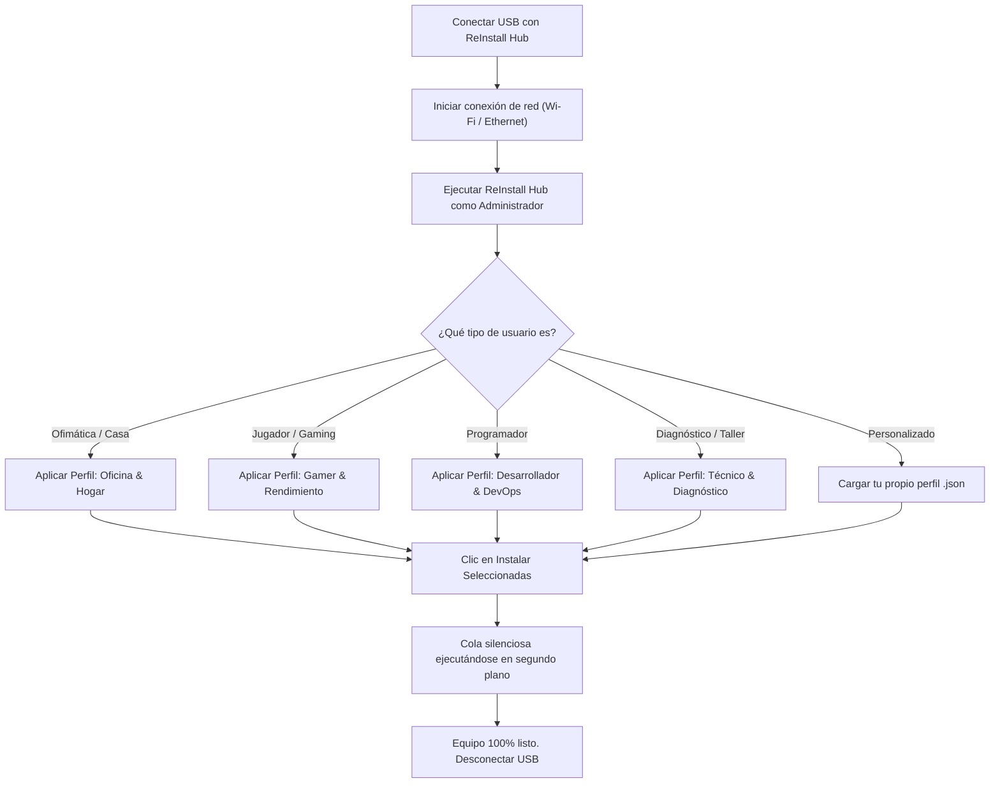

# Guía de Uso Portable para Técnicos | ReInstall Hub

**ReInstall Hub** cuenta con un **Modo Portable Nativo** diseñado especialmente para profesionales de soporte técnico, administradores de sistemas y entusiastas que preparan y configuran equipos recién formateados.

---

## 1. ¿Cómo Funciona el Modo Portable?

Al iniciar la aplicación, **ReInstall Hub detecta de forma automática** el directorio desde el que se ejecuta:

1. **Detección de Ubicación**:
   - Si la aplicación se ejecuta desde una memoria USB, disco duro externo o carpeta de usuario (fuera de `C:\Program Files`), comprueba si el directorio es escribible.
2. **Almacenamiento Local en el Pendrive**:
   - Guarda automáticamente todas las configuraciones y perfiles en la misma carpeta del ejecutable:
     - `reinstall-hub-settings.json`: Preferencias de instalación, idioma y lista de perfiles.
     - Carpeta `profiles/`: Archivos individuales `.json` de cada perfil personalizado.
3. **Cero Residuos en la PC del Cliente**:
   - No se crean carpetas residuales en `%APPDATA%` ni claves en el Registro de Windows de la máquina intervenida. Al desconectar tu memoria USB, el sistema queda completamente limpio.

---

## 2. Cómo Preparar tu Memoria USB

### Opción A: Usar el Ejecutable Portable Autónomo (`.exe`)
1. Descarga desde los **Releases de GitHub** el archivo:
   `ReInstall-Hub-Portable-v1.0.0.exe`
2. Cópialo en la raíz o en una carpeta de tu memoria USB (ejemplo: `E:\Herramientas\ReInstall Hub\`).
3. Haz doble clic para iniciar. La primera vez creará automáticamente su archivo de configuración junto al ejecutable.

### Opción B: Copiar la Carpeta Desempaquetada (`win-unpacked`)
1. En el repositorio compilado, toma la carpeta `release\win-unpacked`.
2. Cópiala a tu pendrive y renómbrala a tu gusto (ej. `ReInstall Hub Portable`).
3. El archivo `ReInstall Hub.exe` está listo para ser ejecutado directamente.

---

## 3. Flujo de Trabajo Recomendado en un Equipo Recién Formateado

---

## 4. Permisos de Administrador y UAC

Para que las aplicaciones se instalen en modo silencioso sin que Windows interrumpa con ventanas de Control de Cuentas de Usuario (UAC) para cada instalador:

- Haz clic derecho sobre el ejecutable y selecciona **"Ejecutar como administrador"**.
- O bien, dentro de la aplicación, observa el indicador en la barra de título superior: si no está elevado, pulsa el botón **"Reiniciar como Administrador"**.

---

## 5. Requisitos del Sistema

- **Sistema Operativo**: Windows 11 (todas las versiones) o Windows 10 (versión 1809 / compilación 17763 en adelante, 64 bits).
- **Windows Package Manager (`winget`)**:
  - Viene preinstalado en Windows 11 y Windows 10 moderno a través de la aplicación *App Installer* de la Microsoft Store.
  - ReInstall Hub verifica la presencia de WinGet en el arranque. Si falta, te indicará cómo habilitarlo con un comando de PowerShell.
- **Conexión a Internet**: Necesaria para descargar los paquetes oficiales más recientes directamente desde los repositorios de Microsoft y de cada desarrollador.
